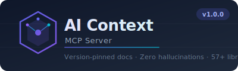

<p align="center">
  
</p>

<p align="center">
  <a href="https://www.npmjs.com/package/ai-context-mcp"></a>
  <a href="https://www.npmjs.com/package/ai-context-mcp"></a>
  <a href="https://github.com/Prathmeshkunturwar/Context_Mcp/blob/main/LICENSE"></a>
  <a href="https://github.com/Prathmeshkunturwar/Context_Mcp/actions"></a>
  <a href="https://github.com/Prathmeshkunturwar/Context_Mcp/blob/main/TESTING.md"></a>
  <a href="https://nodejs.org"></a>
</p>

<p align="center">
  <strong>Give your LLM real-time, version-pinned documentation instead of hallucinated APIs.</strong><br/>
  An MCP server that injects live docs from <strong>57+ AI/ML libraries</strong> directly into Claude, Cursor, or any MCP-compatible client.
</p>

<p align="center">
  🚫 No outdated training data &nbsp;·&nbsp; ✅ Zero telemetry &nbsp;·&nbsp; 📦 Fully local &nbsp;·&nbsp; ⚡ SQLite offline cache
</p>

---

## Table of Contents

- [Why AI Context MCP?](#why-ai-context-mcp)
- [Quick Start](#quick-start)
- [Setup](#setup)
- [Environment Variables](#environment-variables)
- [Tools Reference](#tools-reference)
- [Supported Libraries](#supported-libraries)
- [Architecture](#architecture)
- [Contributing](#contributing)
- [Troubleshooting](#troubleshooting)
- [License](#license)

---

## Why AI Context MCP?

LLMs are trained on static snapshots of the web. By the time you use Claude or Cursor, its knowledge of `langchain`, `openai`, `pytorch` etc. is already months out of date — causing:

- ❌ Hallucinated function signatures that don't exist
- ❌ Deprecated patterns the model confidently recommends
- ❌ Silent breaking changes that crash your app at runtime

**AI Context MCP solves this** by fetching current docs and changelogs from GitHub at query time, ranking them semantically, and injecting them into the model's context window.

---

## Quick Start

**Option 1 — NPM Global Install (recommended)**

```bash
npm install -g ai-context-mcp
```

**Option 2 — Clone & Build**

```bash
git clone https://github.com/Prathmeshkunturwar/Context_Mcp.git
cd Context_Mcp
npm install && npm run build
```

---

## Setup

### Claude Code

Add to your project's `.mcp.json`:

```json
{
  "mcpServers": {
    "ai-context": {
      "command": "npx",
      "args": ["-y", "ai-context-mcp"],
      "env": { "GITHUB_TOKEN": "ghp_your_token_here" }
    }
  }
}
```

### Claude Desktop

Edit `claude_desktop_config.json`:

| OS | Path |
|---|---|
| **Windows** | `%APPDATA%\Claude\claude_desktop_config.json` |
| **macOS** | `~/Library/Application Support/Claude/claude_desktop_config.json` |
| **Linux** | `~/.config/Claude/claude_desktop_config.json` |

```json
{
  "mcpServers": {
    "ai-context": {
      "command": "npx",
      "args": ["-y", "ai-context-mcp"],
      "env": { "GITHUB_TOKEN": "ghp_your_token_here" }
    }
  }
}
```

### Cursor / Other MCP Clients

```json
{
  "mcpServers": {
    "ai-context": {
      "command": "npx",
      "args": ["-y", "ai-context-mcp"],
      "env": { "GITHUB_TOKEN": "ghp_your_token_here" }
    }
  }
}
```

---

## Environment Variables

| Variable | Required | Description |
|---|---|---|
| `GITHUB_TOKEN` | **Recommended** | GitHub PAT. Without it: 60 req/hr. With it: 5,000/hr. [Create one](https://github.com/settings/tokens) (no scopes needed). |
| `TRANSPORT` | Optional | Set to `http` for Express HTTP server instead of stdio. |
| `CACHE_TTL_HOURS` | Optional | Cache TTL in hours (default: 24). |
| `PORT` | Optional | HTTP port when `TRANSPORT=http` (default: 3000). |

---

## Tools Reference

### `resolve-library-id`
Maps natural language to a registry library ID.
```
"LangChain JavaScript" → /langchain-ai/langchainjs
```

### `query-docs`
Fetches version-pinned documentation snippets, semantically ranked using MiniLM-L6.
```
query-docs(libraryId: "/openai/openai-python", query: "streaming", version: "1.0.0")
```

### `get-changelog-diff`
Extracts breaking changes and new features between two versions.
```
get-changelog-diff(libraryId: "/langchain-ai/langchainjs", fromVersion: "0.1.0", toVersion: "0.3.0")
→ 7 BREAKING CHANGES, 12 NEW FEATURES
```

### `get-source-signature`
Extracts raw type/function/class signatures directly from source code.
```
get-source-signature(libraryId: "/langchain-ai/langchainjs", filePath: "...", entityName: "RunnableSequence")
```

### `detect-project-versions`
Scans your local `package.json` or `requirements.txt` to detect installed library versions.
```
detect-project-versions(projectPath: "./")
→ { "langchain": "0.1.0", "@langchain/openai": "0.0.14" }
```

### `auto-migrate-codebase`
Analyzes your codebase against changelog breaking changes and generates migration alerts.
```
auto-migrate-codebase(libraryId: "...", projectPath: "./", fromVersion: "0.1.0", toVersion: "0.3.0")
```

### `suggest-skills`
Scans your project imports and recommends which libraries to look up.
```
suggest-skills(projectPath: "./") → ["/langchain-ai/langchainjs", "/openai/openai-node"]
```

---

## Supported Libraries

### 🤖 LLM Provider SDKs
`OpenAI Python` · `OpenAI Node.js` · `Anthropic Python` · `Anthropic TypeScript` · `Google Generative AI` · `Mistral AI` · `Cohere`

### 🦾 Agent Frameworks
`LangChain Python` · `LangChain.js` · `LangGraph` · `LlamaIndex` · `CrewAI` · `Pydantic AI` · `AutoGen` · `Letta (MemGPT)` · `Vercel AI SDK`

### 🧠 ML Frameworks
`PyTorch` · `HuggingFace Transformers` · `Diffusers` · `Accelerate` · `PEFT` · `Pydantic`

### ⚡ Inference Engines
`vLLM` · `llama.cpp` · `Ollama`

### 🗄️ Vector Databases
`ChromaDB` · `Qdrant` · `Pinecone` · `Weaviate`

### 🌐 Web Frameworks
`React` · `Next.js` · `Vue` · `Nuxt` · `Svelte` · `SvelteKit` · `Express` · `Fastify` · `Hono`

### 🗃️ Database & ORM
`Prisma` · `Drizzle` · `TypeORM` · `Mongoose`

### 🔌 API & Validation
`tRPC` · `Zod` · `Apollo Server`

### 🧪 Testing & Infrastructure
`Vitest` · `Playwright` · `Supabase JS` · `Firebase JS`

> **57 libraries and growing!** Run `npm run add-library` or [open a PR](CONTRIBUTING.md) to add yours.

---

## Architecture

```
┌─────────────────────────────────────────────────────────┐
│                MCP Client (Claude / Cursor)              │
│        resolve → query → changelog → signature           │
└───────────────────────┬─────────────────────────────────┘
                        │ MCP Protocol (stdio / http)
┌───────────────────────▼─────────────────────────────────┐
│               AI Context MCP Server                      │
│                                                          │
│  ┌────────────┐  ┌────────────┐  ┌──────────────────┐   │
│  │  Registry  │  │  Fetcher   │  │ Semantic Ranker   │   │
│  │ (57 libs)  │  │ (GitHub +  │  │  (MiniLM-L6-v2)  │   │
│  └────────────┘  │  Cache)    │  └──────────────────┘   │
│                  └────────────┘                          │
│  ┌────────────┐  ┌────────────┐  ┌──────────────────┐   │
│  │ Changelog  │  │  Snippet   │  │  Source          │   │
│  │  Parser    │  │ Extractor  │  │  Signature       │   │
│  └────────────┘  └────────────┘  └──────────────────┘   │
│                                                          │
│      L1: In-Memory LRU  │  L2: SQLite (offline)         │
└───────────────────────────────────────────────────────────┘
```

---

## Contributing

See [CONTRIBUTING.md](CONTRIBUTING.md) for full guidelines.

```bash
npm run dev          # ts-node with hot reload
npm test             # 39 Jest tests
npm run build        # Compile TypeScript
npm run add-library  # Interactive library adder
```

**Project structure:**
```
src/
├── server.ts              # Entry point
├── registry/libraries.json # Add libraries here
├── sources/               # GitHub, NPM, PyPI, HuggingFace
├── ranking/               # Semantic ranker + snippet extractor
├── cache/                 # Two-tier LRU + SQLite cache
└── tools/                 # changelog, versions, migrate, suggest
```

---

## Troubleshooting

**"Cannot find module" on start**
```bash
npm run build
```

**GitHub 403 / rate limit errors**
Add `GITHUB_TOKEN` to your env — [create a token](https://github.com/settings/tokens) with no extra scopes.

**Stale/outdated docs returned**
```bash
rm -f .cache/ai-context-cache.db
```

**First `npx` run hangs**
The MiniLM model downloads (~25MB) on first run. This is one-time only.

> More help in [docs/TROUBLESHOOTING.md](docs/TROUBLESHOOTING.md) · [Open an issue](https://github.com/Prathmeshkunturwar/Context_Mcp/issues)

---

## License

[MIT](LICENSE) © [Prathmesh Kunturwar](https://github.com/Prathmeshkunturwar)

---

<p align="center">
  <a href="https://github.com/Prathmeshkunturwar/Context_Mcp/issues">🐛 Report Bug</a> ·
  <a href="https://github.com/Prathmeshkunturwar/Context_Mcp/issues">✨ Request Feature</a> ·
  <a href="CONTRIBUTING.md">🤝 Contribute</a>
</p>
<p align="center">If this saves you time, please ⭐ the repo!</p>
